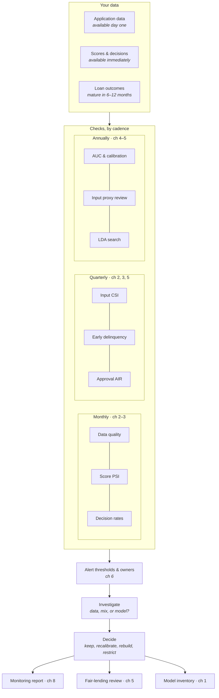

# Lending Model Monitoring Guide

**A practical monitoring framework for lending models at small institutions: CDFIs, community development
credit unions, community banks, and nonprofit loan funds.**

It covers what to check, how often, what level should trigger action, who acts, and what to write down.
It is sized for a lender that scores a few dozen applications a month and has no dedicated model-risk or
data-science team.

---

## Who this is for

You make lending decisions with a scorecard, a vendor score, or a rules engine, and you need to know it is
still working. You may have one analyst, or none. Your loan volumes are small enough that techniques
built for large banks give unreliable answers.

## What is different about this guide

**1. It tells you what to do with the numbers.** Open-source libraries compute drift and fairness metrics.
Supervisory guidance sets principles. Neither tells a small lender *which* checks to run each month, *what
level* should trigger an alert, *who* acts, and *what to write down*. This guide does, in
[chapter 6](guide/06-alerts-owners-actions.md) and the [one-page checklist](CHECKLIST.md).

**2. It is built for small portfolios and slow outcomes.**
- Standard PSI thresholds (0.10 / 0.25) fire on pure noise at small volumes. With 60 applications and 10 bins,
  the *median* PSI from noise alone is about 0.15. The guide uses a sample-size-aware threshold instead
  ([chapter 2](guide/02-input-and-score-stability.md)).
- Defaults take a year to show up, so the guide gives you early-warning checks you can run at six months on book
  ([chapter 3](guide/03-early-warning.md)).
- Performance metrics are always reported with confidence intervals, because a few dozen defaults cannot
  support a point estimate on their own ([chapter 4](guide/04-performance-and-calibration.md)).
- Everything can be run in a **spreadsheet** ([`spreadsheet/monitoring-calculator.xlsx`](spreadsheet/monitoring-calculator.xlsx))
  or in a single Python notebook.

**3. It goes from fair-lending outcomes to inputs.** Beyond testing whether approval rates differ across
groups, it shows how to find *which inputs* drive a difference, whether each has a business justification,
and whether a less discriminatory alternative exists without meaningful loss of predictive power
([chapter 5](guide/05-fair-lending-review.md)). It reflects the 2026 changes to Regulation B.

## How it fits together



Everything runs from a [one-page checklist](CHECKLIST.md), a [spreadsheet](spreadsheet/monitoring-calculator.xlsx),
or a [Python notebook](examples/walkthrough.ipynb).

## Contents

| | |
|---|---|
| [**CHECKLIST.md**](CHECKLIST.md) | The whole framework on one page |
| [1. Scope and inventory](guide/01-scope-and-inventory.md) | Which models, materiality tiers, baselines |
| [2. Data quality and stability](guide/02-input-and-score-stability.md) | Missing data, PSI/CSI, the small-sample problem |
| [3. Early warning](guide/03-early-warning.md) | Decision rates, early delinquency vs expected, vintages |
| [4. Performance and calibration](guide/04-performance-and-calibration.md) | AUC with intervals, calibration, recalibrate vs rebuild |
| [5. Fair-lending review](guide/05-fair-lending-review.md) | BISG-weighted outcomes, input-level proxy review, LDA search |
| [6. Alerts, owners, actions](guide/06-alerts-owners-actions.md) | Cadence, thresholds, owners, escalation |
| [7. Vendor models](guide/07-vendor-models.md) | Monitoring what you cannot see inside; what to ask vendors |
| [8. Documentation](guide/08-documentation.md) | The four documents and common gaps |
| [Appendix: regulatory context](guide/appendix-regulatory-context.md) | 2026 model-risk guidance and Regulation B changes |
| [`thresholds.csv`](thresholds.csv) | Starting alert thresholds, owners, first actions |
| [`templates/`](templates/) | Model inventory, monitoring report, fair-lending review |
| [`spreadsheet/`](spreadsheet/) | PSI, early-warning, and AIR calculator (no code needed) |
| [`examples/`](examples/) | Worked example on synthetic data: [`walkthrough.ipynb`](examples/walkthrough.ipynb) |

## Quick start

**No code:** read the [checklist](CHECKLIST.md), open the [spreadsheet calculator](spreadsheet/monitoring-calculator.xlsx),
and replace the yellow example values with your own counts.

**Python:**

```bash
git clone https://github.com/hannahxuhang-hue/lending-model-monitoring-guide.git
cd lending-model-monitoring-guide
pip install -r requirements.txt
cd examples && jupyter notebook walkthrough.ipynb
```

[`monitoring_checks.py`](examples/monitoring_checks.py) is a single file of plain functions (pandas, numpy,
scipy) that you can copy into your own work.

## About the data

All data in this repository is **synthetic**, generated by
[`examples/synthetic_data.py`](examples/synthetic_data.py). It does not describe any real lender, applicant,
or model. The group-membership probabilities are simulated, not computed from names or addresses.

## Companion repository

[**Causal Uplift Targeting Guide**](https://github.com/hannahxuhang-hue/causal-uplift-targeting-guide): measuring and
targeting the incremental effect of outreach at small lenders. Any targeting model it produces belongs in the monitoring
cycle described here.

## Scope and disclaimer

This is a personal project, written on personal time. It draws only on published methods and public
regulatory sources, cited in each chapter and below. It contains no data, code, thresholds, or documentation
from any employer, and it is not affiliated with or endorsed by any employer or financial institution.

This guide is general methodology. It is **not legal, regulatory, or compliance advice**. Thresholds are
illustrative starting points. Confirm your obligations with counsel and your examiner.

## References

- Board of Governors of the Federal Reserve System (2026). *SR 26-2: Revised Guidance on Model Risk Management.*
- OCC (2025). *Bulletin 2025-26: Model Risk Management: Clarification for Community Banks.*
- Consumer Financial Protection Bureau (2026). *Equal Credit Opportunity Act (Regulation B)*, final rule, April 22, 2026.
- Consumer Financial Protection Bureau (2014). *Using Publicly Available Information to Proxy for Unidentified Race and Ethnicity.*
- Elliott, M. N., et al. (2009). Using the Census Bureau's surname list to improve estimates of race/ethnicity and associated disparities. *Health Services and Outcomes Research Methodology*, 9(2), 69–83.
- Gillis, T., Meursault, V., & Ustun, B. (2024). Operationalizing the search for less discriminatory alternatives in fair lending. *Proceedings of ACM FAccT 2024.*
- Hanley, J. A., & McNeil, B. J. (1982). The meaning and use of the area under a receiver operating characteristic (ROC) curve. *Radiology*, 143(1), 29–36.
- Yurdakul, B. (2018). *Statistical Properties of Population Stability Index.* Dissertation, Western Michigan University.
- Federal Reserve Bank of Richmond (2026). *2025 CDFI Survey: Key Findings.*

## Feedback and use

If you work at a lender or network and use or adapt this material, or find it doesn't fit how you work,
please open an issue or get in touch. Feedback from practitioners shapes the next revision.

## How to cite

See [`CITATION.cff`](CITATION.cff), or: Xu, H. (2026). *Lending Model Monitoring Guide* (Version 1.0).
https://github.com/hannahxuhang-hue/lending-model-monitoring-guide

## License

Guide text, checklist, templates, and spreadsheet: [CC BY 4.0](LICENSE-docs.md). Code: [MIT](LICENSE).
You may use, adapt, and redistribute both, including inside your institution's own policies, with attribution.

**Author:** Hang (Hannah) Xu
